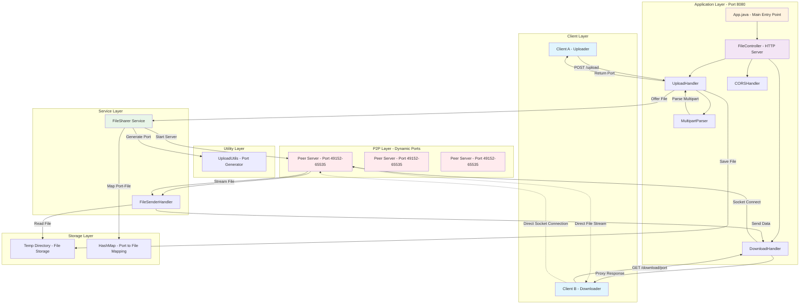
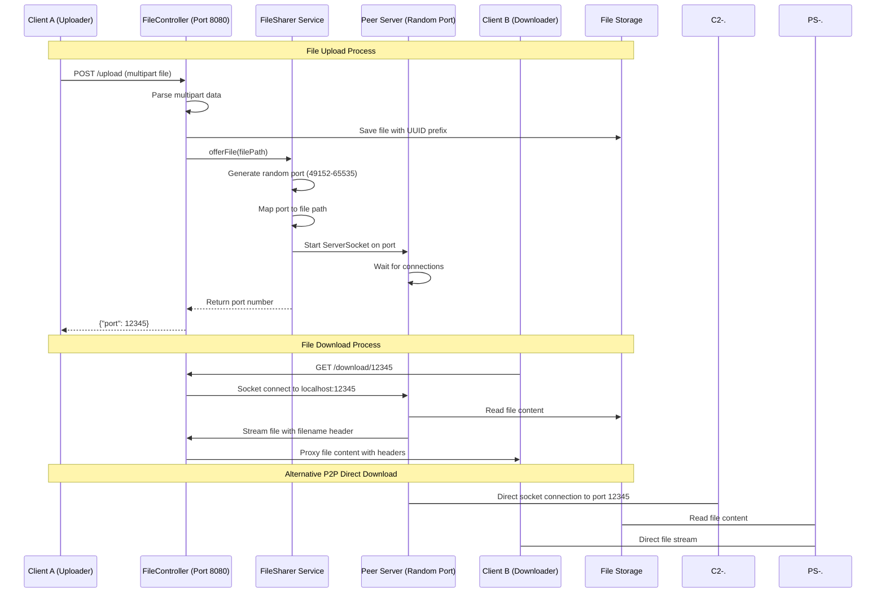
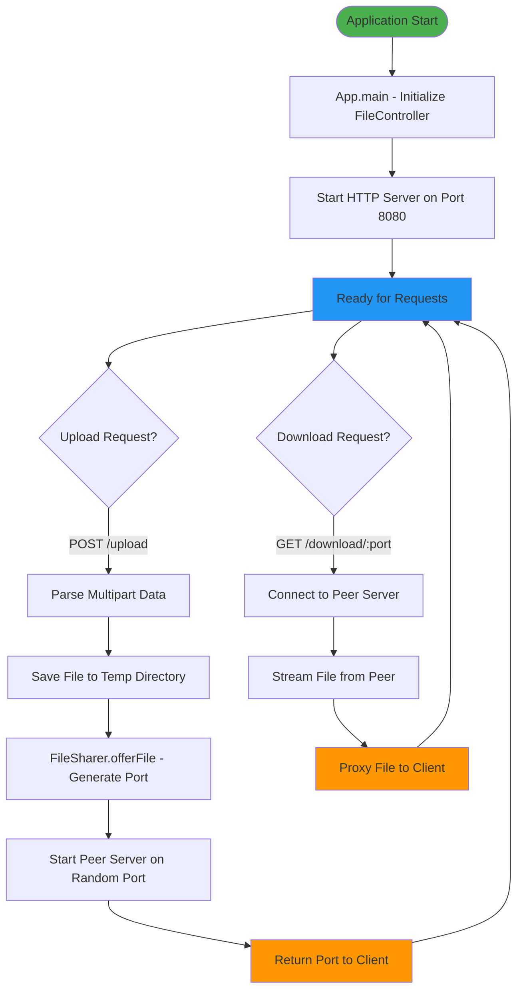

# P2P File Sharing System Architecture

```mermaid
graph TB
    subgraph "Client Layer"
        C1[Client A - Uploader]
        C2[Client B - Downloader]
    end

    subgraph "Application Layer - Port 8080"
        APP[App.java - Main Entry Point]
        FC[FileController - HTTP Server]
        UH[UploadHandler]
        DH[DownloadHandler]
        CH[CORSHandler]
        MP[MultipartParser]
    end

    subgraph "Service Layer"
        FS[FileSharer Service]
        FSH[FileSenderHandler]
    end

    subgraph "Utility Layer"
        UU[UploadUtils - Port Generator]
    end

    subgraph "Storage Layer"
        TEMP[Temp Directory - File Storage]
        MAP[HashMap - Port to File Mapping]
    end

    subgraph "P2P Layer - Dynamic Ports"
        PS1[Peer Server - Port 49152-65535]
        PS2[Peer Server - Port 49152-65535]
        PSN[Peer Server - Port 49152-65535]
    end

    %% Application Startup Flow
    APP --> FC
    FC --> UH
    FC --> DH
    FC --> CH

    %% Upload Flow
    C1 -->|POST /upload| UH
    UH --> MP
    MP -->|Parse Multipart| UH
    UH -->|Save File| TEMP
    UH -->|Offer File| FS
    FS -->|Generate Port| UU
    FS -->|Map Port-File| MAP
    FS -->|Start Server| PS1
    PS1 --> FSH
    UH -->|Return Port| C1

    %% Download Flow
    C2 -->|GET /download/port| DH
    DH -->|Socket Connect| PS1
    PS1 -->|Stream File| FSH
    FSH -->|Read File| TEMP
    FSH -->|Send Data| DH
    DH -->|Proxy Response| C2

    %% P2P Direct Transfer (Alternative)
    C2 -.->|Direct Socket Connection| PS1
    PS1 -.->|Direct File Stream| C2

    %% Styling
    style C1 fill:#e1f5fe
    style C2 fill:#e1f5fe
    style APP fill:#fff3e0
    style FC fill:#f3e5f5
    style FS fill:#e8f5e8
    style PS1 fill:#ffebee
    style PS2 fill:#ffebee
    style PSN fill:#ffebee
```

## Sequence Diagram - File Upload and Download Process

```mermaid
sequenceDiagram
    participant C1 as Client A (Uploader)
    participant API as FileController (Port 8080)
    participant FS as FileSharer Service
    participant PS as Peer Server (Random Port)
    participant C2 as Client B (Downloader)
    participant TEMP as File Storage
    
    Note over C1, TEMP: File Upload Process
    C1->>API: POST /upload (multipart file)
    API->>API: Parse multipart data
    API->>TEMP: Save file with UUID prefix
    API->>FS: offerFile(filePath)
    FS->>FS: Generate random port (49152-65535)
    FS->>FS: Map port to file path
    FS->>PS: Start ServerSocket on port
    PS->>PS: Wait for connections
    FS-->>API: Return port number
    API-->>C1: {"port": 12345}
    
    Note over C1, TEMP: File Download Process
    C2->>API: GET /download/12345
    API->>PS: Socket connect to localhost:12345
    PS->>TEMP: Read file content
    PS->>API: Stream file with filename header
    API->>C2: Proxy file content with headers
    
    Note over C1, TEMP: Alternative P2P Direct Download
    C2-.->PS: Direct socket connection to port 12345
    PS-.->TEMP: Read file content
    PS-.->C2: Direct file stream
```

## Component Interaction Flow

```mermaid
flowchart TD
    START([Application Start]) --> INIT[App.main - Initialize FileController]
    INIT --> SERVER[Start HTTP Server on Port 8080]
    SERVER --> READY[Ready for Requests]
    
    READY --> UPLOAD{Upload Request?}
    READY --> DOWNLOAD{Download Request?}
    
    UPLOAD -->|POST /upload| PARSE[Parse Multipart Data]
    PARSE --> SAVE[Save File to Temp Directory]
    SAVE --> OFFER[FileSharer.offerFile - Generate Port]
    OFFER --> PSERVER[Start Peer Server on Random Port]
    PSERVER --> RESPONSE[Return Port to Client]
    RESPONSE --> READY
    
    DOWNLOAD -->|GET /download/:port| CONNECT[Connect to Peer Server]
    CONNECT --> STREAM[Stream File from Peer]
    STREAM --> PROXY[Proxy File to Client]
    PROXY --> READY
    
    style START fill:#4caf50
    style READY fill:#2196f3
    style RESPONSE fill:#ff9800
    style PROXY fill:#ff9800
```
