# ShareIO P2P File Sharing System Architecture

## System Overview

## Detailed Upload & Download Flow with Password Support

## Detailed Component Interaction & State Management

```mermaid
flowchart TD
    START([ShareIO Application Start]) --> INIT[App.main Initialize]
    INIT --> SERVER[Create HttpServer on Port 8080]
    SERVER --> HANDLERS[Register HTTP Handlers]
    HANDLERS --> READY[🟢 Service Ready]
    
    READY --> UPLOAD_REQ{Upload Request?}
    READY --> DOWNLOAD_REQ{Download Request?}
    READY --> HEALTH_REQ{Health Check?}
    
    %% Upload Flow
    UPLOAD_REQ -->|POST /upload| PARSE_MP[Parse Multipart Data]
    PARSE_MP --> EXTRACT[Extract File + Password]
    EXTRACT --> VALIDATE_FILE{File Valid?}
    
    VALIDATE_FILE -->|❌ Invalid| ERROR_RESP[400 Bad Request]
    VALIDATE_FILE -->|✅ Valid| SAVE_FILE[Save to Temp Directory]
    
    SAVE_FILE --> GEN_UUID[Generate UUID Filename]
    GEN_UUID --> OFFER_FILE[FileSharer.offerFile]
    OFFER_FILE --> GEN_PORT[Generate Random Port 49152-65535]
    GEN_PORT --> CHECK_PORT{Port Available?}
    
    CHECK_PORT -->|❌ Taken| GEN_PORT
    CHECK_PORT -->|✅ Available| CREATE_INFO[Create FileInfo Object]
    CREATE_INFO --> MAP_PORT[Map Port → FileInfo]
    MAP_PORT --> START_SERVER[Start Background Peer Server]
    START_SERVER --> RETURN_PORT[Return Port to Client]
    RETURN_PORT --> READY
    
    %% Download Flow
    DOWNLOAD_REQ -->|GET /download/:port| EXTRACT_PORT[Extract Port from URL]
    EXTRACT_PORT --> EXTRACT_PASS[Extract Password from Query]
    EXTRACT_PASS --> CHECK_EXISTS{File Exists on Port?}
    
    CHECK_EXISTS -->|❌ No| NOT_FOUND[404 Not Found]
    CHECK_EXISTS -->|✅ Yes| CHECK_PASS{Password Required?}
    
    CHECK_PASS -->|✅ Yes| VALIDATE_PASS{Password Valid?}
    CHECK_PASS -->|❌ No| CONNECT_PEER[Connect to Peer Server]
    
    VALIDATE_PASS -->|❌ Invalid| UNAUTHORIZED[401 Unauthorized]
    VALIDATE_PASS -->|✅ Valid| CONNECT_PEER
    
    CONNECT_PEER --> SOCKET_CONN[Socket Connect localhost:port]
    SOCKET_CONN --> READ_HEADER[Read Filename Header]
    READ_HEADER --> STREAM_FILE[Stream File Content]
    STREAM_FILE --> PROXY_CLIENT[Proxy to Client]
    PROXY_CLIENT --> READY
    
    %% Health Check Flow
    HEALTH_REQ -->|GET /health| HEALTH_RESP[Return Service Status JSON]
    HEALTH_RESP --> READY
    
    %% Error Flows
    ERROR_RESP --> READY
    NOT_FOUND --> READY
    UNAUTHORIZED --> READY
    
    %% Styling
    style START fill:#4caf50,color:#fff
    style READY fill:#2196f3,color:#fff
    style ERROR_RESP fill:#f44336,color:#fff
    style NOT_FOUND fill:#f44336,color:#fff
    style UNAUTHORIZED fill:#ff9800,color:#fff
    style RETURN_PORT fill:#8bc34a,color:#fff
    style PROXY_CLIENT fill:#8bc34a,color:#fff
    style HEALTH_RESP fill:#8bc34a,color:#fff
```

## CLI Integration & User Experience Flow

```mermaid
flowchart LR
    subgraph "CLI Commands"
        CMD_POST[shareio post file.txt --pass xyz]
        CMD_GET[shareio get 54321 --pass xyz]
        CMD_HEALTH[Health Check]
    end
    
    subgraph "Backend Service Interaction"
        API_UPLOAD[POST /upload]
        API_DOWNLOAD[GET /download/54321?pass=xyz]
        API_HEALTH[GET /health]
    end
    
    subgraph "User Experience"
        UPLOAD_SUCCESS[📤 File uploaded<br/>Share code: 54321]
        DOWNLOAD_SUCCESS[📥 File downloaded<br/>Saved to: ./filename.ext]
        SERVICE_STATUS[✅ Service running]
        ERROR_MSG[❌ Error: Unauthorized/Not Found]
    end
    
    CMD_POST --> API_UPLOAD
    API_UPLOAD --> UPLOAD_SUCCESS
    
    CMD_GET --> API_DOWNLOAD
    API_DOWNLOAD --> DOWNLOAD_SUCCESS
    API_DOWNLOAD --> ERROR_MSG
    
    CMD_HEALTH --> API_HEALTH
    API_HEALTH --> SERVICE_STATUS
    
    style CMD_POST fill:#e3f2fd
    style CMD_GET fill:#e3f2fd
    style UPLOAD_SUCCESS fill:#e8f5e8
    style DOWNLOAD_SUCCESS fill:#e8f5e8
    style ERROR_MSG fill:#ffebee
```

## Security & Data Flow Architecture

```mermaid
graph TB
    subgraph "Security Layer"
        PASS_VAL[Password Validation]
        CORS[CORS Protection]
        FILE_VAL[File Validation]
        UUID_GEN[UUID Generation]
    end
    
    subgraph "Data Processing"
        MULTIPART[Multipart Parser]
        STREAM[File Streaming]
        HEADER[Header Processing]
    end
    
    subgraph "Memory Management"
        HASHMAP[Port → FileInfo HashMap]
        TEMP_FILES[Temporary File Storage]
        CLEANUP[Automatic Cleanup]
    end
    
    subgraph "Network Layer"
        HTTP_8080[HTTP Server :8080]
        SOCKET_POOL[Dynamic Socket Pool<br/>:49152-65535]
        CONN_HANDLE[Connection Handling]
    end
    
    PASS_VAL --> HASHMAP
    FILE_VAL --> TEMP_FILES
    UUID_GEN --> TEMP_FILES
    
    MULTIPART --> TEMP_FILES
    STREAM --> SOCKET_POOL
    HEADER --> STREAM
    
    HTTP_8080 --> SOCKET_POOL
    SOCKET_POOL --> CONN_HANDLE
    
    HASHMAP --> CLEANUP
    TEMP_FILES --> CLEANUP
    
    style PASS_VAL fill:#e0f2f1
    style CORS fill:#e0f2f1
    style FILE_VAL fill:#e0f2f1
    style UUID_GEN fill:#e0f2f1
```

